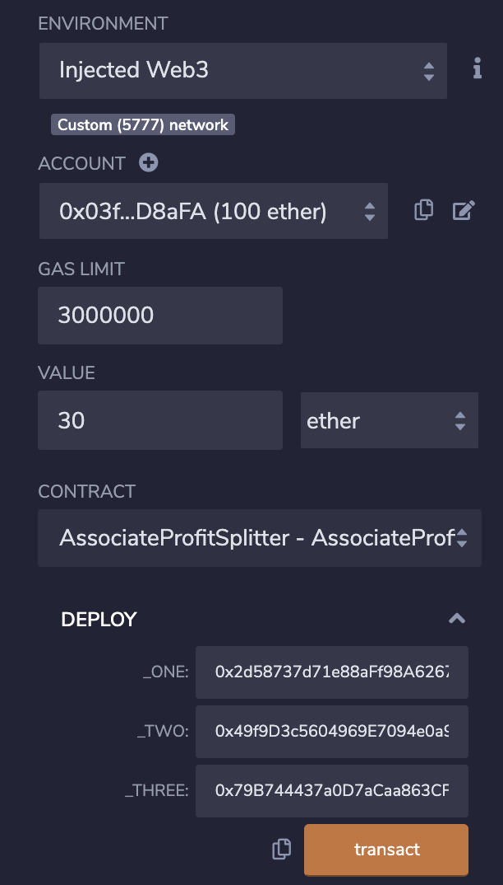
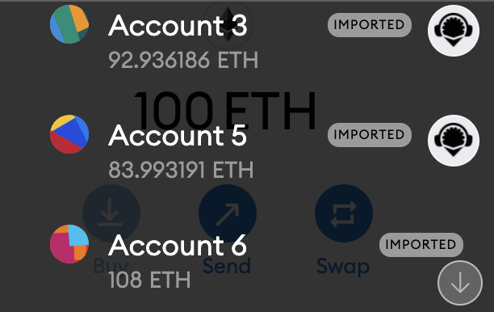
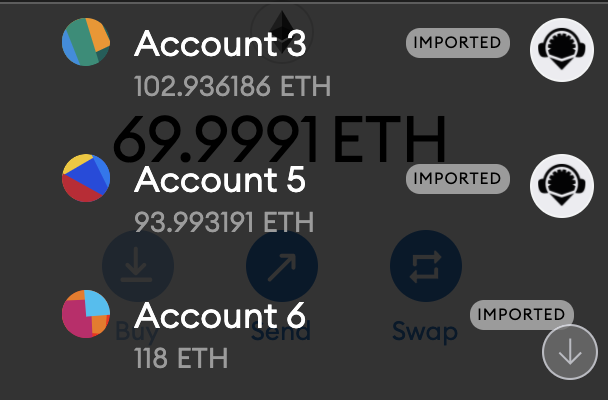

# Associate Profit Splitter
Address to smart contract: 0x46316d9Db31c748A8e7845F4f2F78C24f90BC54F

- On the Deploy & Run Transactions column, we can input how many Ether we want to deposit under "Value". Make sure you are in the right address you want to send Ether from on your MetaMask, that address should appear under "Address" in the Deploy page. 
- Input the three addresses we want to send Ether to via the Deploy drop down and hit "transact"

- the amount of Ether under "Value" will then be split in three and sent to the chosen addresses. Below is the Balance of our three addresses before and after the transaction. 

